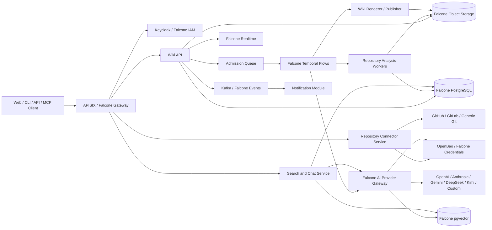

# Falcone Gap Analysis for the LLM Code Wiki Platform

**Document version:** 1.0  
**Assessment date:** 2026-08-03  
**Falcone repository:** [gntik-ai/falcone](https://github.com/gntik-ai/falcone)  
**Assessed branch:** `main`  
**Assessed commit:** [`9d8eec4476621e7592498178045a0d564f23aa76`](https://github.com/gntik-ai/falcone/commit/9d8eec4476621e7592498178045a0d564f23aa76)  
**Related requirements:** `LLM_CODE_WIKI_FUNCTIONAL_REQUIREMENTS.md`

---

## 1. Executive conclusion

Falcone is a strong architectural foundation for this product, but it is not the product itself and it is not yet a complete production foundation for storing and processing customer source code.

Falcone already provides many of the expensive infrastructure primitives the LLM Code Wiki needs:

- tenant and workspace lifecycle;
- Keycloak-based authentication and identity;
- password-based accounts and configurable social identity providers;
- coarse tenant/workspace roles;
- PostgreSQL and document storage APIs;
- object storage;
- pgvector/vector-search and embedding-provider primitives;
- Kafka events and realtime delivery;
- functions;
- signed webhooks and scheduling;
- Temporal-backed durable Flows with cancellation, retry, signals, SSE monitoring, quotas, and audit;
- per-workspace BYOK LLM completion with model allow-listing, streaming, and token usage;
- OpenBao-backed secret capabilities;
- APISIX gateway, service accounts/OAuth applications, plans, quotas, audit, backup, and operational controls.

However, the platform still lacks the product-domain services and several reusable AI/platform capabilities required by the requirements baseline:

1. repository connectors and secure Git acquisition;
2. project, run-admission, source-snapshot, wiki, page, diagram, citation, collaboration, and publication domains;
3. code parsing, dependency analysis, incremental invalidation, and documentation generation;
4. a user-visible fair queue with an approximate position;
5. multiple simultaneous LLM provider connections per workspace;
6. a self-service bridge from user-entered provider keys to the LLM executor;
7. native provider adapters and a model capability catalog;
8. provider Batch API orchestration;
9. OAuth/cloud-identity lifecycle for LLM providers;
10. a detailed usage and monetary cost ledger;
11. static wiki rendering/hosting, version-aware search/chat, and export;
12. production-readiness evidence sufficient for private customer code.

The recommended approach is therefore:

- **Use Falcone for shared BaaS and execution primitives.**
- **Build the code-wiki domain as separate application services on Falcone.**
- **Add a bounded set of reusable AI and job-platform features to Falcone itself.**
- **Treat Falcone production hardening and security validation as a release gate, not a later optimization.**

---

## 2. Assessment method and confidence

This analysis reviewed the public `main` branch and, in particular:

- [Falcone README](https://github.com/gntik-ai/falcone/blob/9d8eec4476621e7592498178045a0d564f23aa76/README.md)
- [Console authentication configuration](https://github.com/gntik-ai/falcone/blob/9d8eec4476621e7592498178045a0d564f23aa76/docs/reference/architecture/console-auth-config.md)
- [Flows architecture](https://github.com/gntik-ai/falcone/blob/9d8eec4476621e7592498178045a0d564f23aa76/docs-site/architecture/flows.md)
- [Workspace secrets console and runtime](https://github.com/gntik-ai/falcone/blob/9d8eec4476621e7592498178045a0d564f23aa76/docs/reference/architecture/workspace-secrets-console.md)
- [BYOK provider confinement](https://github.com/gntik-ai/falcone/blob/9d8eec4476621e7592498178045a0d564f23aa76/docs/reference/architecture/byok-provider-secret-confinement.md)
- [LLM executor](https://github.com/gntik-ai/falcone/blob/9d8eec4476621e7592498178045a0d564f23aa76/apps/control-plane-executor/src/runtime/llm-executor.mjs)
- [Control-plane executor wiring](https://github.com/gntik-ai/falcone/blob/9d8eec4476621e7592498178045a0d564f23aa76/apps/control-plane-executor/src/runtime/main.mjs)
- embedding/vector-search tests and implementation;
- repository-wide searches for GitHub/GitLab connectors, provider batch endpoints, queue position, model settings UI, and static wiki hosting.

No live Falcone deployment was exercised for this document. Therefore:

- **“Covered”** means the inspected repository contains a clear merged implementation and contract suitable as a foundation.
- **“Partial”** means a useful primitive exists but does not satisfy the product requirement end to end.
- **“Application gap”** means the capability belongs primarily in the LLM Code Wiki product, not necessarily in Falcone core.
- **“Falcone platform gap”** means a reusable platform capability should be added or extended in Falcone.
- **“Operational blocker”** means the code may exist, but production use should not proceed without additional operational/security evidence.
- **“Not evidenced”** means no implementation was found in the inspected commit and searches; it is not a claim that no unmerged or private implementation exists.

---

## 3. Critical release blocker: Falcone production readiness

Falcone’s README explicitly describes the project as being in early development, not production-ready, without stability, security, data-durability, support, upgrade-compatibility, or security-audit guarantees. That warning must be taken literally when the proposed product will ingest private repositories and send selected source content to external model providers.

### GAP-PRD-001 — Critical — Production-readiness status

**Current state:** Operational blocker.

**Impact:** The application would hold valuable proprietary source code, repository credentials, provider keys, derived architecture information, embeddings, and execution history. A pre-1.0 platform warning is incompatible with an unqualified production launch.

**Required closure evidence:**

- supported production topology and version matrix;
- threat model and independent security review;
- tenant-isolation tests covering all used APIs and background paths;
- secret lifecycle and credential-compromise procedures;
- migration, upgrade, rollback, and compatibility guarantees;
- backup/restore rehearsals covering application-domain data;
- high-availability and multi-replica behavior;
- capacity and soak tests for large workflows and object storage;
- disaster-recovery objectives and evidence;
- vulnerability, dependency, image, and supply-chain controls;
- operational SLOs, alerting, incident response, and support ownership;
- a defined supported release rather than a moving development branch.

**Recommendation:** Make “Falcone production readiness for private source-code workloads” a P0 program with an explicit go/no-go checklist before external users connect private repositories.

---

## 4. What Falcone already covers well

### 4.1 Identity, tenancy, and gateway

Falcone has a per-tenant Keycloak model, authentication configuration, tenant/workspace identity, service accounts/OAuth applications, APISIX routing, and server-side tenant scoping. This is a strong fit for application login and organization/workspace isolation.

The authentication documentation also evidences registration, email login, password reset, remember-me, verification, and configured social identity providers. Social-provider listing/deletion is exposed in the console, but provider creation/editing is explicitly deferred from that UI.

### 4.2 Durable workflows

Falcone Flows are backed by Temporal and support durable execution, retries, sequence/parallel branches, timers, signals/approvals, child flows, cron/webhook/event triggers, list/describe/cancel/retry/signal operations, server-stamped tenant search attributes, SSE node/log monitoring, quotas, and audit.

This is a strong basis for the internal generation pipeline. It does **not** by itself satisfy the product requirement for a fair admission queue with a user-visible position.

### 4.3 Storage, events, realtime, functions, and data

Falcone supplies PostgreSQL, a document API, object storage, Kafka events, realtime delivery, functions, webhooks, and scheduling. These are appropriate primitives for metadata, generated artifacts, notifications, and orchestration events.

### 4.4 Secrets

Falcone has OpenBao-backed, write-only workspace secrets for function deployment, with metadata-only reads, server-side resolution, role gates, audit redaction, and rotation behavior. This is a valuable foundation.

The current LLM BYOK path, however, is wired differently: it resolves keys from operator-mounted environment variables with an allow-listed prefix. The two mechanisms are not yet an end-user self-service provider-secret flow.

### 4.5 LLM and embeddings

Falcone has:

- a per-workspace LLM provider record;
- an endpoint and model allow-list;
- an OpenAI-compatible `/chat/completions` backend;
- streaming;
- request-time secret resolution;
- endpoint SSRF protection;
- token-usage recording;
- a Flow `llm.complete` activity;
- an embedding provider;
- vector search/pgvector support and embedding tests.

These features materially reduce the implementation needed, but the current model is too narrow for the complete product.

---

## 5. Coverage matrix — identity, tenancy, and collaboration

| Capability required by the product | Status | Evidence / current limitation | Recommended ownership |
|---|---|---|---|
| Username/password registration and login | **Covered foundation** | Keycloak-based tenant auth and documented registration/login/reset configuration. | Falcone |
| Social login runtime | **Covered foundation** | Configured identity providers are represented per tenant. | Falcone |
| Social provider create/edit in console | **Partial** | Auth documentation states backend routes exist, but console create/edit is deferred. | Falcone enhancement or product settings UI |
| Account linking and duplicate-account protection | **Needs validation/extension** | Keycloak can support identity brokering, but complete product UX and policies were not evidenced. | Falcone + product |
| MFA/passkeys | **Not evidenced for product UX** | May be possible through Keycloak configuration, but no complete application flow was verified. | Falcone/Keycloak configuration + product UI |
| Organizations and workspaces | **Covered foundation** | Core tenant/workspace lifecycle is a Falcone capability. | Falcone |
| Tenant/workspace isolation | **Covered foundation, security gate remains** | Strong server-side scoping is documented in multiple domains; must be penetration-tested for this workload. | Falcone |
| Coarse tenant roles | **Covered foundation** | Tenant owner/admin/developer/viewer-style gates exist. | Falcone |
| Project-specific roles | **Application gap** | No code-wiki project domain or project-scoped RBAC was evidenced. | Product |
| Groups/teams and approval workflow | **Application gap / possible IAM extension** | No code-wiki collaboration workflow exists. | Product, optionally Falcone IAM enhancement |
| Service accounts and OAuth applications | **Covered foundation** | Listed as Falcone platform capabilities. | Falcone |
| Invitation and membership audit | **Covered/partial foundation** | Tenant membership exists; project collaboration events must be added. | Falcone + product |
| Support access controls | **Partial** | Platform personas/roles exist; product-specific time-limited support workflow must be designed. | Falcone operations + product |
| Public/unlisted wiki access | **Application gap** | No wiki publication domain exists. | Product |
| Per-project comments/reviews/approvals | **Application gap** | No relevant domain implementation evidenced. | Product |

### Main conclusion — identity, tenancy, and collaboration

Falcone should remain authoritative for identity and workspace membership. The product should add a project-level authorization layer that stores project roles and always evaluates them together with the verified Falcone tenant/workspace identity.

---

## 6. Coverage matrix — repository connectivity and source acquisition

| Capability | Status | Evidence / current limitation | Recommended ownership |
|---|---|---|---|
| Public Git repository URL | **Application gap** | No repository connector/acquisition domain was found. | Product |
| GitHub App installation | **Application gap** | No GitHub App repository integration was evidenced. | Product; generic connector framework may later move to Falcone |
| GitLab OAuth/application | **Application gap** | No GitLab connector was evidenced. | Product |
| Generic HTTPS token | **Application gap using Falcone secrets** | Secret primitive exists, connector does not. | Product + Falcone secrets |
| Generic SSH/deploy key | **Application gap using Falcone secrets** | No Git SSH host-key or deploy-key lifecycle was evidenced. | Product + Falcone secrets |
| Repository enumeration | **Application gap** | No GitHub/GitLab repository browser found. | Product |
| Signed VCS webhooks | **Partial primitive** | Falcone has generic signed/retried webhooks and Flow triggers, but no provider-specific VCS installation/event handling. | Product connector, Falcone webhooks/events |
| Webhook deduplication | **Covered primitive / product logic missing** | Flow/webhook idempotency patterns exist; VCS commit coalescing is absent. | Product on Falcone |
| Branch/tag/commit resolution | **Application gap** | No Git domain found. | Product |
| Secure clone/archive retrieval | **Application gap** | No clone worker or source snapshot service found. | Product |
| Monorepo roots/exclusions | **Application gap** | No product source configuration. | Product |
| Submodules and Git LFS | **Application gap** | No implementation evidenced. | Product |
| Self-managed Git hosts | **Application gap with platform networking implications** | Falcone has endpoint guards but no approved Git-host registry/private connector. | Product + Falcone/operator networking |
| Repository credential rotation | **Partial primitive** | Secret rotation primitives exist; repository-domain impact handling does not. | Product + Falcone secrets |
| Source snapshot object storage | **Covered primitive** | Falcone object storage can hold snapshots/artifacts. | Falcone storage, product lifecycle |
| Source access audit | **Partial primitive** | Audit infrastructure exists; product events must be emitted. | Product + Falcone audit |
| Prompt-injection-safe ingestion | **Application gap** | No repository analysis pipeline exists. | Product |
| Analysis sandbox | **Partial/architecture gap** | Functions exist, including a production Knative path, but no dedicated long-running source-analysis sandbox was evidenced. | Product worker runtime; possible Falcone reusable runtime |
| Private-network Git connector | **Platform/application gap** | No secure connector agent/tunnel was evidenced. | Falcone platform or deployment-specific service |

### Main conclusion — repository connectivity and source acquisition

Repository connectivity should be implemented as a dedicated product service first. It should use Falcone identity, secrets, storage, events, and audit, but should not be forced into a generic function invocation if large clones and analysis need stronger isolation, disk, and duration semantics.

---

## 7. Coverage matrix — projects, queue, and workflow execution

| Capability | Status | Evidence / current limitation | Recommended ownership |
|---|---|---|---|
| Project CRUD | **Application gap** | No LLM-wiki project domain exists. | Product |
| Project configuration versions | **Application gap** | Flow definition versioning exists but is not a project configuration domain. | Product |
| Run entity and durable orchestration | **Strong covered foundation** | Temporal Flows provide durable execution, cancellation, retry, signals, monitoring, and version pinning. | Falcone Flows + product run metadata |
| Stage progress and logs | **Covered primitive / mapping required** | Flow SSE emits node status/log frames; product must map nodes to user stages and redact logs. | Product on Falcone |
| Cancel running execution | **Covered foundation** | Flow executor supports cancellation and tenant-scoped mutation. | Falcone + product UX |
| Retry execution | **Covered foundation** | Flows expose retry lifecycle/audit. | Falcone + product policy |
| Queue durability | **Covered at workflow/task level** | Temporal task queues are durable. | Falcone |
| User-visible queue position | **Falcone platform gap** | No queue-position, ahead-count, or admission-rank implementation was found. Temporal worker queues do not provide the required product semantics directly. | Reusable Falcone admission-queue service or product service |
| Tenant-fair admission | **Falcone platform gap** | Quotas exist, but no explicit weighted fair scheduler/admission queue was evidenced. | Falcone reusable job layer |
| Project/provider concurrency limits | **Partial** | Flow quotas exist; product dimensions and scheduler admission are missing. | Falcone + product |
| Queue priority classes | **Gap** | No product admission priority/fairness model found. | Falcone reusable job layer |
| Approximate ETA | **Application gap** | Requires queue telemetry and historical models. | Product |
| Delete pending run separately from project | **Application gap** | Flow cancel exists; the project/run domain and UI distinction must be built. | Product |
| Commit-event coalescing | **Application gap** | No source/run scheduler domain. | Product |
| Provider-batch wait state | **Falcone platform gap** | No provider batch executor or state mapping found. | Falcone AI platform |
| Atomic wiki publication | **Application gap** | Flow durability helps, but wiki version/pointer transaction is absent. | Product |
| Run cost/budget gate | **Partial** | Falcone quotas and token usage exist; monetary reservation and run budget policy are missing. | Falcone usage/cost + product |
| Long-running analysis worker | **Partial/architecture gap** | Temporal worker exists; current activity catalog is platform-oriented. Dedicated parser/clone workers are required. | Product worker fleet |
| Workflow payload protection | **Operational hardening gap** | Flow docs note execution tokens are persisted in Temporal history and recommend a payload codec or server-side lookup when history readers exist. | Falcone operations/core |

### Recommended queue design

Do not expose a raw Temporal task-queue rank. Introduce an **admission queue** in front of workflow start:

1. Validate source, model, policy, quota, and estimated budget.
2. Create a durable queued run and admission record.
3. Compute eligibility and approximate rank using tenant fairness, priority, provider capacity, and concurrency.
4. Start the Temporal Flow only when admitted.
5. Continue using Temporal for durable execution and cancellation.
6. Stream admission and Flow status through Falcone realtime/SSE.

This produces honest product queue semantics without weakening Temporal’s internal scheduling model.

---

## 8. Coverage matrix — LLM providers, models, embeddings, and batch

| Capability | Status | Evidence / current limitation | Recommended ownership |
|---|---|---|---|
| Per-workspace LLM configuration | **Covered but structurally limited** | `workspace_llm_providers` is keyed uniquely by `(tenant_id, workspace_id)`. | Falcone |
| Multiple provider connections in one workspace | **Critical Falcone platform gap** | Current schema allows one LLM provider record per workspace, not OpenAI + Anthropic + DeepSeek/Kimi simultaneously. | Falcone core enhancement |
| Multiple allowed models on one endpoint | **Covered** | `allowedModels` and `defaultModel` exist. | Falcone |
| Model shown only when configured | **Covered backend concept / UI gap** | Allow-list fails closed, but product model-settings and selector UX are absent. | Falcone API + product UI |
| Self-service user API-key entry | **Critical partial/gap** | Workspace secrets accept write-only values, but current LLM executor is wired to resolve `BYOK_` environment variables mounted by the operator. | Falcone core integration |
| Plaintext secret exclusion | **Covered** | Provider records persist only `secretRef`; BYOK guard and write-only secret design are documented. | Falcone |
| Secret rotation at request time | **Covered for mounted secret** | Executor resolves the secret on each request. | Falcone |
| OAuth provider credentials | **Falcone platform gap** | No delegated OAuth token, refresh-token, expiry, scope, or revocation lifecycle for LLM providers was evidenced. | Falcone credential broker |
| Cloud IAM/service account auth | **Falcone platform gap** | Current HTTP backend expects `Authorization: Bearer <resolved key>`. | Falcone provider adapters |
| OpenAI-compatible completions | **Covered foundation** | HTTP backend posts OpenAI-style chat-completion requests and parses SSE. | Falcone |
| Native OpenAI Responses API | **Gap/extension** | Current backend targets chat completions; Responses-specific semantics not evidenced. | Falcone AI platform |
| Native Anthropic Messages | **Falcone platform gap** | Native headers, message shape, caching, batches, and usage are not represented by generic backend. | Falcone adapter |
| Native Gemini GenerateContent | **Falcone platform gap** | Native request/auth/batch semantics not evidenced. | Falcone adapter |
| DeepSeek/Kimi compatible endpoint | **Potential partial** | Compatible mode may work when the service exposes the required OpenAI shape; capability must be tested, not assumed. | Falcone adapter registry |
| Model discovery | **Falcone platform gap** | Current configuration stores a manual allow-list; no provider discovery/catalog service was found. | Falcone |
| Capability catalog | **Falcone platform gap** | No normalized context, output, tools, structured output, caching, batch, region, or retirement metadata. | Falcone |
| Model health/deprecation | **Gap** | No current model lifecycle registry evidenced. | Falcone |
| Separate models by pipeline stage | **Application gap over Falcone** | Product generation profile does not exist. | Product |
| Structured output/tool schemas | **Partial/gap** | Current LLM request builder exposes messages, max tokens, temperature, stream; tools/JSON schemas were not evidenced. | Falcone |
| Provider Batch APIs | **Critical Falcone platform gap** | Searches found no OpenAI `/v1/batches`, Anthropic message batches, or Gemini batch implementation. | Falcone |
| Provider batch cancellation/result ingestion | **Gap** | No provider batch domain exists. | Falcone |
| Embedding provider | **Covered foundation** | Per-workspace embedding provider and request-time secret resolution exist. | Falcone |
| pgvector/vector search | **Covered foundation** | Vector search, KNN, embedding, quotas, and pgvector tests are present. | Falcone |
| Embedding re-index warning | **Covered concept** | Tests evidence a warning on provider replacement. | Falcone |
| Hybrid lexical + vector index | **Partial** | Vector primitives exist; project-aware lexical/source index and atomic wiki index version do not. | Product |
| Token usage | **Covered but insufficient** | Usage rollup records prompt/completion/total by model. | Falcone |
| Stage/run/provider attribution | **Falcone platform gap** | Current usage schema lacks project/run/stage/provider request/batch/retry/cache dimensions. | Falcone usage ledger |
| Monetary cost | **Falcone platform gap** | No versioned pricing catalog or currency cost ledger evidenced. | Falcone |
| Prompt caching accounting | **Gap** | Not represented in current request/usage model. | Falcone |
| Provider data-region/policy metadata | **Gap** | No normalized connection policy catalog found. | Falcone + product policy |

### The two most important LLM-platform changes

#### GAP-AI-001 — Multiple provider connections

Replace the one-row-per-workspace model with a first-class `provider_connections` domain:

- `connection_id`
- tenant/workspace scope
- provider adapter type
- display name
- endpoint/region
- credential reference and auth type
- enabled state
- health
- policy labels
- model entries and capability snapshots
- created/updated/rotated metadata

Projects and runs must reference `connection_id + model_id`, not merely workspace + model string.

#### GAP-AI-002 — Self-service secret resolution

Connect the LLM/embedding executors to an end-user write-only secret reference stored in OpenBao or an equivalent per-workspace credential service. Do not require an operator to mount a new `BYOK_*` environment variable for every customer credential.

The resolver must:

- verify tenant/workspace and connection ownership;
- retrieve the value server-side only;
- never return it through API/UI;
- support replacement and revocation;
- audit access metadata with value redaction;
- cache only if policy permits and for a bounded duration;
- distinguish API key, OAuth token set, service account, and workload identity;
- work consistently in the HTTP executor and Temporal activities.

## 9. Coverage matrix — code intelligence, wiki, diagrams, and synchronization

| Capability | Status | Evidence / current limitation | Recommended ownership |
|---|---|---|---|
| Repository inventory and manifest | **Application gap** | No Git/source-analysis domain exists. | Product |
| Language parser/AST registry | **Application gap** | No source parser framework evidenced. | Product |
| Symbol/dependency/call graphs | **Application gap** | Falcone graph or data primitives may store results, but no code graph exists. | Product |
| API/schema/infrastructure extraction | **Application gap** | No code-intelligence pipeline exists. | Product |
| Existing-doc reconciliation | **Application gap** | No wiki generator exists. | Product |
| Source-grounded citations | **Application gap** | No citation/code-reference domain exists. | Product |
| Page planning and templates | **Application gap** | No wiki planning system found. | Product |
| Markdown page generation | **Application gap** | Workspace docs services in Falcone are platform documentation, not arbitrary repository wikis. | Product |
| Rendered wiki | **Application gap** | No project wiki renderer/reader was evidenced. | Product |
| Mermaid/diagram generation | **Application gap** | No code-wiki diagram domain exists. | Product |
| Safe Markdown/SVG rendering | **Application gap** | Must be built in product frontend/rendering service. | Product |
| Human editing and generated sections | **Application gap** | No page revision or merge model exists. | Product |
| Wiki versioning | **Application gap** | Flow versions are unrelated to wiki content versions. | Product |
| Atomic publication | **Application gap using Falcone data/storage** | Requires wiki version and index pointer transactions. | Product |
| Incremental Git diff | **Application gap** | No Git baseline or commit graph domain. | Product |
| Impact analysis/invalidation | **Application gap** | No source-to-page dependency graph exists. | Product |
| Reuse/cache of unchanged analysis | **Application gap** | Generic caches may exist but no product cache/provenance model. | Product |
| Full-scan fallback | **Application gap** | Must be controlled by source/config compatibility logic. | Product |
| Historical wiki version compare/rollback | **Application gap** | No wiki version domain. | Product |
| Static HTML/Markdown export | **Application gap** | Object storage helps, but no exporter exists. | Product |
| Hosted static wiki/custom domain | **Application gap / possibly external service** | No static-site hosting/custom-domain capability found. | Product or dedicated hosting component |

### Main conclusion — code intelligence, wiki, and synchronization

These are not defects in a general BaaS; they are the core differentiating application. They should not all be added to Falcone. Falcone should expose stable primitives, while the code-wiki services own the domain and its algorithms.

---

## 10. Coverage matrix — search, chat, collaboration, notifications, and publication

| Capability | Status | Evidence / current limitation | Recommended ownership |
|---|---|---|---|
| Vector storage/search | **Covered foundation** | pgvector and embedding provider exist. | Falcone |
| Exact code/symbol search | **Application gap** | No lexical source index or symbol index domain. | Product |
| Hybrid retrieval | **Application gap over Falcone** | Must combine product lexical/structured data with Falcone vector search. | Product |
| Repository-grounded chat | **Partial primitive** | LLM completion exists; project/version retrieval, citations, histories, and policies do not. | Product + Falcone LLM |
| Chat streaming | **Covered primitive** | LLM executor supports streaming. | Falcone |
| Chat conversation storage | **Application gap** | No code-wiki conversation domain found. | Product |
| Version-consistent citations | **Application gap** | No wiki/index version domain. | Product |
| No-answer/evidence policy | **Application gap** | Prompt and quality behavior belongs to product. | Product |
| Project comments and approvals | **Application gap** | No collaboration domain. | Product |
| Public/unlisted wiki sharing | **Application gap** | No wiki publication domain. | Product |
| Notification event transport | **Covered primitive** | Kafka/events, realtime, webhooks, and scheduling exist. | Falcone |
| In-app/email notification product | **Partial/application gap** | Transport exists; user notification center/preferences/templates were not evidenced for this domain. | Product |
| Outbound signed webhooks | **Covered primitive** | Falcone has signed/retried webhooks. | Falcone + product event contracts |
| API/service accounts | **Covered foundation** | Falcone provides gateway/API and service accounts/OAuth applications. | Falcone |
| Code-wiki REST/OpenAPI | **Application gap** | Product APIs do not exist. | Product |
| Code-wiki MCP | **Partial primitive** | Falcone MCP exists, but no wiki-specific resources/tools or project retrieval. | Product on Falcone MCP or separate server |
| Git export/PR creation | **Application gap** | Requires separate write connector and export domain. | Product |

---

## 11. Coverage matrix — usage, budgets, quotas, audit, and operations

| Capability | Status | Evidence / current limitation | Recommended ownership |
|---|---|---|---|
| Token metering | **Covered basic primitive** | Prompt/completion/total tokens are recorded per workspace/model. | Falcone |
| Per-run/stage usage | **Gap** | Current LLM usage schema does not include project, run, stage, actor, provider request, retry, or batch item. | Falcone |
| Monetary cost ledger | **Gap** | No pricing snapshots or currency calculations found. | Falcone |
| Cost estimate | **Application gap over Falcone catalog** | Requires repository inventory and provider pricing/capability data. | Product + Falcone |
| Soft/hard budgets | **Partial** | Falcone plans/quotas exist; monetary budget reservation and enforcement are absent. | Falcone + product |
| Batch savings attribution | **Gap** | No batch or pricing ledger. | Falcone |
| Workspace/project quota dimensions | **Partial** | Falcone quota framework exists, but project/code-wiki dimensions must be added. | Falcone + product |
| Audit infrastructure | **Covered foundation** | Flow lifecycle and secret mutations have audit paths; platform audit is a stated capability. | Falcone |
| Product-domain audit | **Application gap** | Projects, pages, citations, publication, access, exports, and source events must emit records. | Product |
| Observability | **Covered foundation/extension needed** | Falcone has observability patterns; product services need metrics/traces and SLOs. | Both |
| Backup/restore | **Covered platform foundation / integration gap** | Falcone provides backup/restore capabilities; application wiki/index consistency must be designed and tested. | Both |
| HA/multi-replica safety | **Operational validation required** | Some stores are Postgres-backed; production guarantees are explicitly not offered in README. | Falcone operations |
| Temporal history confidentiality | **Hardening required** | Flows documentation warns execution tokens appear in workflow history without payload encryption/codec. | Falcone core/operations |
| Secret audit redaction | **Covered** | Workspace-secret documentation explicitly describes redacted auditing. | Falcone |
| Customer support diagnostics | **Partial** | Correlation patterns exist; product support bundle and source minimization are missing. | Product |
| Data retention/purge | **Partial** | Platform lifecycle exists, but project-derived object/index/chat/version purge graph is absent. | Product + Falcone |

---

## 12. Detailed Falcone platform gaps

### GAP-FAL-001 — Multiple provider connections per workspace

**Severity:** P0  
**Type:** Falcone platform gap

The current `workspace_llm_providers` schema has a unique key on `(tenant_id, workspace_id)`. This supports one endpoint with multiple allowed models, but not several independently authenticated providers in the same workspace.

**Required change:**

- introduce connection IDs;
- support multiple LLM and embedding connections;
- keep model allow-lists per connection;
- reference connections from executions and usage;
- support connection scope and RBAC;
- preserve existing endpoint compatibility through migration;
- prevent one connection update from replacing another;
- allow separate planner, generator, verifier, embedding, and chat providers.

**Suggested OpenSpec change:** `add-multi-provider-connection-registry`

---

### GAP-FAL-002 — End-user provider secret lifecycle

**Severity:** P0  
**Type:** Falcone platform gap

The LLM executor currently resolves an allow-listed environment variable, typically mounted by ESO/Vault. That is secure for operator-managed deployment but not sufficient for a SaaS screen where each customer enters or rotates an API key.

**Required change:**

- create a provider-credential resource whose value is write-only;
- store the value in OpenBao under tenant/workspace/connection scope;
- return metadata only;
- resolve it server-side during LLM, embedding, batch, and Flow activity execution;
- provide atomic replacement, deletion, health test, expiry, and audit;
- support more than bearer API keys;
- eliminate the need for one environment variable per customer connection.

**Suggested OpenSpec change:** `integrate-byok-with-workspace-secret-store`

---

### GAP-FAL-003 — Provider authentication broker

**Severity:** P1, P0 for providers selected at launch  
**Type:** Falcone platform gap

The current backend assumes a bearer secret. Native providers and enterprise deployments may require OAuth token sets, service-account JSON, AWS-style signed requests, Azure managed identity, Google workload identity, or provider-specific headers.

**Required change:**

- normalized authentication types;
- OAuth authorization/callback/state/PKCE;
- encrypted refresh-token storage;
- expiry and refresh locking;
- revocation;
- service-account and workload-identity adapters;
- provider-specific request signing;
- auditable credential use without exposing values.

**Suggested OpenSpec change:** `add-provider-credential-broker`

---

### GAP-FAL-004 — Native LLM provider adapters

**Severity:** P0  
**Type:** Falcone platform gap

OpenAI compatibility is useful, but it is not a complete provider abstraction. Native Anthropic and Gemini APIs have different request shapes, authentication, usage, batching, caching, file, safety, and error semantics.

**Required adapter contract:**

- validate connection;
- list or reconcile models;
- normalize capabilities;
- synchronous completion/generation;
- streaming;
- structured output/tool schema where supported;
- token/usage normalization;
- provider request ID;
- rate-limit and retry metadata;
- prompt/context caching metadata;
- batch submit/status/cancel/results;
- redacted diagnostics;
- provider-specific policy and region fields.

**Suggested OpenSpec changes:**

- `add-native-openai-provider-adapter`
- `add-native-anthropic-provider-adapter`
- `add-native-gemini-provider-adapter`
- `add-compatible-provider-adapter-contract`

DeepSeek and Kimi should be enabled through a tested compatible adapter initially when their selected endpoints satisfy the contract; native adapters should be added when required for unsupported capabilities.

---

### GAP-FAL-005 — Model catalog and capability registry

**Severity:** P0  
**Type:** Falcone platform gap

A manual `allowedModels` array cannot drive an accurate product selector or batch policy by itself.

**Required model metadata:**

- connection/provider;
- stable and display model IDs;
- active/deprecated/retired status;
- input modalities;
- context and output limits;
- structured output and tool support;
- streaming;
- batch;
- prompt caching;
- embedding dimension where relevant;
- regional availability;
- pricing reference;
- data-policy labels;
- last verified time;
- discovery source and manual override.

**Suggested OpenSpec change:** `add-model-capability-catalog`

---

### GAP-FAL-006 — Provider Batch API abstraction

**Severity:** P0  
**Type:** Falcone platform gap

No provider-batch implementation was found. The product needs more than submitting files: it needs a durable cross-provider lifecycle with item correlation and cost attribution.

**Required entities and operations:**

- provider batch;
- provider batch item;
- request manifest and immutable input hash;
- submit;
- accepted/processing/finalizing/completed/failed/expired/cancelling/cancelled;
- result streaming/download;
- per-item success/error;
- cancellation;
- retry of failed items;
- provider result retention;
- reconciliation after worker outage;
- usage and price capture;
- Flow activity/tasks for submit/wait/results.

**Suggested OpenSpec change:** `add-llm-provider-batch-execution`

---

### GAP-FAL-007 — Detailed usage and cost ledger

**Severity:** P0  
**Type:** Falcone platform gap

The current usage rollup is useful for basic token metering, but it is too coarse for cost control and audit.

**Required dimensions:**

- tenant/workspace/project;
- run, stage, request, batch, item, retry group;
- actor/trigger;
- connection, provider, model;
- synchronous/batch/cache mode;
- input/output/cached/reasoning/embedding units;
- provider-reported usage and calculation method;
- pricing snapshot, currency, unit rates;
- estimated and actual cost;
- provider request ID;
- status and correction relation.

**Required functions:**

- append-only usage;
- idempotent provider-result ingestion;
- rollups;
- budget decisions;
- reservations and reconciliation;
- CSV/JSON export;
- pricing updates without rewriting historical cost basis.

**Suggested OpenSpec change:** `add-ai-usage-cost-ledger`

---

### GAP-FAL-008 — Fair admission queue with position

**Severity:** P0  
**Type:** Falcone platform gap or reusable adjacent service

Temporal task queues should remain internal. Add a durable admission layer that exposes product-safe queue semantics.

**Required functions:**

- validated admission record;
- tenant/workspace/project/provider concurrency;
- weighted fairness;
- bounded priority;
- approximate rank/ahead count;
- rank-change stream;
- reservation of quota and estimated budget;
- cancellation before workflow start;
- admission lease and workflow-start idempotency;
- queue pause/drain;
- telemetry and admin controls.

**Suggested OpenSpec change:** `add-tenant-fair-job-admission-queue`

---

### GAP-FAL-009 — Large-task worker profile

**Severity:** P0  
**Type:** Falcone platform/operations gap

Repository cloning and parsing need ephemeral disk, process isolation, language runtimes, controlled network access, and potentially longer execution than ordinary request handlers.

**Required capability:**

- dedicated worker image/profile;
- ephemeral tenant-isolated volume;
- CPU/memory/disk/process/time limits;
- no code execution by default;
- optional separately approved command sandbox;
- source/provider egress allow-list;
- no inherited platform/customer secrets;
- artifact upload through scoped credentials;
- cancellation and heartbeat;
- image provenance and scanning.

This may remain a product-owned worker fleet coordinated by Falcone Flows. It should become Falcone core only if intended as a reusable large-job runtime.

**Suggested product epic:** `build-repository-analysis-worker-runtime`

---

### GAP-FAL-010 — Project-aware quota dimensions

**Severity:** P1  
**Type:** Falcone platform extension

Falcone’s quota framework should add dimensions for:

- active/queued project runs;
- repository files/bytes;
- stored source snapshots;
- wiki versions/pages;
- vector rows;
- generated/export bytes;
- LLM/embedding/chat units;
- batch items;
- retained conversations;
- outbound webhook delivery.

**Suggested OpenSpec change:** `add-code-wiki-quota-dimensions`

---

### GAP-FAL-011 — Social identity-provider management UX

**Severity:** P1  
**Type:** Falcone console gap

The backend can manage identity providers, while the inspected console documentation states create/edit is deferred.

**Required change:**

- create/edit form;
- provider templates;
- client secret as write-only input;
- callback URL instructions;
- enable/disable/test;
- duplicate/provider-link safeguards;
- tenant role gates;
- audit.

This may be implemented in Falcone’s console for reuse or in the product administration UI if Falcone remains headless for end users.

---

### GAP-FAL-012 — Flow payload confidentiality hardening

**Severity:** P0 operational hardening  
**Type:** Falcone core/operations

The Flows documentation notes that execution-token data is persisted in Temporal history and recommends payload encryption or server-side lookup where history readers exist.

For the code-wiki product:

- no provider key, repository token, raw OAuth refresh token, or secret value may enter workflow input/history;
- use opaque secret/connection IDs;
- add a Temporal payload codec or encryption where sensitive non-secret customer metadata remains;
- tightly restrict Temporal UI/history access;
- define retention and deletion;
- test activity logs and errors for source/secret leakage.

**Suggested OpenSpec change:** `encrypt-sensitive-flow-payloads`

---

## 13. Product-domain services that should not be forced into Falcone core

### 13.1 `wiki-api`

Owns:

- projects and configuration versions;
- project-level RBAC;
- source snapshots;
- runs and application state;
- wiki versions, pages, revisions, diagrams, citations;
- reviews, comments, visibility;
- exports and publication;
- search/chat session policy;
- product REST/OpenAPI.

Uses Falcone for verified identity, PostgreSQL/data APIs, storage, events, realtime, quotas, and audit.

### 13.2 `repo-connector-service`

Owns:

- GitHub App;
- GitLab OAuth/application;
- generic HTTPS/SSH;
- repository enumeration;
- token refresh/installation tokens;
- webhooks;
- clone authorization;
- branch/tag/commit resolution;
- self-managed host policy;
- source manifest request.

Uses Falcone secrets, webhooks, events, and audit.

### 13.3 `analysis-orchestrator`

Owns product stage definitions and starts a Falcone Flow after admission.

Suggested stages:

1. validate project, source, model, quota, and budget;
2. acquire immutable source snapshot;
3. inventory and classify;
4. parse and build symbol/dependency graph;
5. calculate full or incremental impact;
6. plan wiki hierarchy;
7. create evidence chunks;
8. execute synchronous/batched LLM tasks;
9. generate diagrams;
10. verify claims, citations, Markdown, and diagrams;
11. build lexical/vector indexes;
12. create candidate wiki version;
13. approval if required;
14. atomically publish;
15. notify and clean temporary source.

### 13.4 `analysis-worker`

Owns Git checkout workspaces, parsers, AST/language services, graph extraction, chunking, secret redaction, prompt-injection defenses, and optional controlled introspection.

### 13.5 `wiki-renderer`

Owns safe Markdown rendering, Mermaid validation/rendering, navigation, static export, source/render view, and publication artifacts.

### 13.6 `search-chat-service`

Owns hybrid retrieval, project/version authorization, citation assembly, no-answer policy, conversation storage, and chat usage attribution. It calls Falcone LLM and vector services.

### 13.7 `notification-service` or application module

Owns user preferences, templates, in-app records, email dispatch policy, digests, and resource-safe content. It uses Falcone events/realtime/webhooks.

---

## 14. Recommended target architecture

### 14.1 Architecture rule

Falcone is the **shared platform control and data foundation**. The application must not bypass its verified tenant/workspace context when calling product services, workers, storage, vector search, LLM providers, or Flow activities.

### 14.2 Credential rule

Browsers and product-domain databases store only credential references and metadata. Credential values travel only from the server-side secret resolver to the exact outbound connector/provider request that requires them.

### 14.3 Publication rule

A candidate wiki version is assembled under a new immutable version ID. Page, diagram, citation, search, and vector artifacts are validated before one transaction or pointer switch makes the version current.

### 14.4 Queue rule

The admission queue supplies user position and fairness; Temporal supplies durable execution. These are complementary, not competing mechanisms.

---

## 15. Proposed application data model on Falcone

The following is a minimum logical schema. Physical placement may use Falcone PostgreSQL, object storage, and pgvector.

### 15.1 Repository and project

- `repository_connections`
- `repositories`
- `repository_webhooks`
- `projects`
- `project_members`
- `project_configuration_versions`
- `project_generation_profiles`
- `source_snapshots`
- `source_files`

### 15.2 Analysis

- `analysis_entities`
- `analysis_relationships`
- `analysis_chunks`
- `analysis_evidence_sets`
- `analysis_cache_entries`
- `analysis_coverage_reports`

### 15.3 Execution

- `project_runs`
- `run_attempts`
- `run_stages`
- `admission_queue_entries`
- `provider_batches`
- `provider_batch_items`
- `run_artifacts`

### 15.4 Wiki

- `wiki_versions`
- `wiki_pages`
- `wiki_page_revisions`
- `wiki_diagrams`
- `wiki_diagram_revisions`
- `wiki_citations`
- `wiki_publications`
- `wiki_exports`

### 15.5 Search and chat

- `search_index_versions`
- `source_lexical_index` or external index references
- tenant-scoped pgvector rows with project/wiki-version metadata
- `chat_conversations`
- `chat_messages`
- `answer_citations`
- `answer_feedback`

### 15.6 Collaboration and governance

- `comments`
- `reviews`
- `approvals`
- `share_links`
- `notifications`
- `retention_holds`
- product audit event references

### 15.7 AI platform additions

- `provider_connections`
- `provider_credentials` metadata only
- `provider_models`
- `model_capability_snapshots`
- `ai_usage_ledger`
- `pricing_snapshots`
- `budget_policies`
- `budget_reservations`

### 15.8 Mandatory keys

Every customer-domain row must include:

- tenant ID;
- workspace ID;
- immutable resource ID;
- project ID where relevant;
- created/updated timestamps;
- creator/updater where relevant;
- version or optimistic-lock value;
- deletion/purge state where relevant.

Source-derived rows must additionally include source snapshot and/or wiki version. Vector rows must include embedding connection/model/dimension and index version.

---

## 16. Prioritized implementation backlog

### P0-A — Falcone release gate

1. Define and pass production readiness checklist.
2. Complete threat model for private source and BYOK.
3. Run independent security assessment.
4. Prove cross-tenant isolation for all used APIs, events, storage, vector, Flows, workers, and caches.
5. Enable/validate Temporal payload confidentiality and restricted history access.
6. Rehearse backup/restore and disaster recovery with application data.
7. Validate HA, upgrades, migrations, rollback, capacity, and observability.

### P0-B — Falcone AI platform

1. Multi-provider connection registry.
2. OpenBao-backed self-service provider credentials.
3. Native adapter contract.
4. Native launch-provider adapters.
5. Model/capability catalog.
6. Provider batch abstraction.
7. Detailed AI usage and cost ledger.
8. Budget/quota hooks.
9. Provider settings APIs and, optionally, reusable UI.

### P0-C — Reusable execution platform

1. Tenant-fair admission queue.
2. Position/ahead-count stream.
3. project/provider concurrency gates.
4. budget reservation integration.
5. large-task worker security profile.
6. workflow secret-reference and payload rules.

### P0-D — Product core

1. Wiki API and data model.
2. project-level RBAC.
3. GitHub, GitLab, and generic Git connectors.
4. secure acquisition and source snapshots.
5. parser/code-graph framework.
6. repository map and wiki planner.
7. Markdown/citation/diagram generator.
8. full-run Flow.
9. incremental diff/impact pipeline.
10. candidate validation and atomic publication.
11. reader/editor, project/run dashboard, cancellation.
12. lexical/vector search and grounded chat.
13. estimate, actual usage, budgets, notifications.
14. Markdown/static HTML export.
15. deletion and purge graph.

### P1 — Product and platform breadth

- MFA/enterprise SSO integration polish;
- comments/reviews/approvals;
- model migrations/fallback/routing;
- additional native providers;
- prompt caching;
- custom templates;
- Git PR export;
- public/unlisted hosting and custom domains;
- CLI and wiki MCP;
- data residency and richer retention;
- audit/usage exports;
- advanced diagrams and translation.

### P2 — Advanced capabilities

- multi-repository projects;
- pull/merge-request wiki previews;
- controlled build/introspection;
- cross-version and cross-repository chat;
- customer-managed encryption keys;
- portfolio-level knowledge graph.

---

## 17. Suggested OpenSpec change set for Falcone

The following changes can be developed independently but should share the same provider, identity, and usage contracts:

1. `add-multi-provider-connection-registry`
2. `integrate-byok-with-workspace-secret-store`
3. `add-provider-credential-broker`
4. `add-model-capability-catalog`
5. `add-native-openai-provider-adapter`
6. `add-native-anthropic-provider-adapter`
7. `add-native-gemini-provider-adapter`
8. `add-compatible-provider-adapter-contract`
9. `add-llm-provider-batch-execution`
10. `add-ai-usage-cost-ledger`
11. `add-tenant-fair-job-admission-queue`
12. `add-code-wiki-quota-dimensions`
13. `encrypt-sensitive-flow-payloads`
14. `complete-social-idp-management-console`
15. `define-large-task-worker-security-profile`

Each OpenSpec should include:

- public API and event contracts;
- tenant/workspace authorization;
- failure and idempotency semantics;
- migration and backward compatibility;
- secret redaction;
- audit events;
- quotas;
- black-box tests;
- multi-replica tests;
- operator runbook;
- production-readiness acceptance evidence.

---

## 18. Recommended boundary decisions

### Decision 1 — Keep repository connectors in the product initially

Repository connections are closely coupled to project lifecycle, source snapshots, and update semantics. Implement them in the product while using Falcone secrets/events/audit. Generalize into Falcone only after at least two products need the same connector framework.

### Decision 2 — Put provider registry, credentials, adapters, batches, and usage in Falcone

These are reusable AI-platform capabilities already adjacent to Falcone’s LLM and embedding executors. Implementing them only in the wiki product would duplicate core provider and secret logic.

### Decision 3 — Put queue admission in Falcone or a reusable platform service

User-visible position, fairness, budget reservation, and concurrency are broadly useful to any expensive Falcone Flow. The wiki product can be the first consumer, but the contract should be generic.

### Decision 4 — Keep code intelligence and wiki domain in the product

Parsers, graph construction, page planning, citations, diagram policies, human-edit boundaries, and incremental documentation are the product’s differentiating logic.

### Decision 5 — Use dedicated workers, not unrestricted repository code execution

Falcone Flows should orchestrate. Dedicated workers should clone and parse. Repository scripts remain disabled by default; optional introspection requires a separate sandbox profile and user authorization.

### Decision 6 — Treat public hosting as product infrastructure

Object storage is a base primitive. Authentication-aware wiki routing, static-site build, custom domains, visibility, and source-hiding rules belong to the product or a dedicated publishing service.

---

## 19. Go/no-go criteria for a private beta

A private beta that accepts private repositories should not start until all of the following are true:

1. Falcone has a supported release/build for the beta environment.
2. Tenant isolation is tested across all resources used by the product.
3. Repository and provider credentials are fully self-service, write-only, rotated, revocable, and never placed in workflow history.
4. Git workers are isolated and repository code does not execute by default.
5. At least one private GitHub path, GitLab path, and generic Git path passes end-to-end security tests.
6. At least two LLM connections can coexist in one workspace.
7. Selected launch providers have validated adapters and model capability records.
8. Batch mode has correct state, cancellation, partial-result, reconciliation, and usage behavior for every advertised provider.
9. Queue position is honest and tenant-fair.
10. Source snapshots, generated artifacts, indexes, and histories have tested deletion and restore.
11. Current wiki publication is atomic and failure-safe.
12. Every answer/page citation is access-controlled and version-consistent.
13. Cost estimates, actual usage, budget blocks, and retry/batch accounting are tested.
14. Audit and support diagnostics contain no secrets or unnecessary source.
15. A security review, incident runbook, and customer data-processing disclosures are complete.

---

## 20. Overall fit assessment

| Area | Fit |
|---|---|
| Identity and tenant foundation | **Strong** |
| Data, storage, events, realtime | **Strong foundation** |
| Durable execution | **Strong foundation** |
| Secrets | **Strong primitive, missing provider self-service integration** |
| LLM/embedding | **Useful early foundation, substantial extension required** |
| Vector search | **Strong primitive** |
| User-visible job queue | **Missing** |
| Git/repository integration | **Missing application domain** |
| Code intelligence | **Missing application domain** |
| Wiki generation/rendering/versioning | **Missing application domain** |
| Incremental synchronization | **Missing application domain** |
| Batch optimization | **Missing platform capability** |
| Cost ledger/budgets | **Partial to missing** |
| Collaboration/publication | **Missing application domain** |
| Production readiness | **Critical blocker based on repository’s own warning** |

### Final recommendation

Proceed with Falcone as the designated BaaS, but do not frame the implementation as “a frontend on top of existing Falcone endpoints.” The correct plan is a product composed of domain services that use Falcone, plus a focused Falcone AI/job-platform roadmap.

The most efficient order is:

1. close the Falcone production and credential gaps;
2. add multi-provider, capability, batch, usage, and admission-queue foundations;
3. build repository acquisition and project/run domains;
4. build full wiki generation and atomic publication;
5. add incremental updates;
6. add grounded search/chat, collaboration, export, and advanced provider breadth.

This preserves Falcone’s role as a reusable BaaS while avoiding the mistake of embedding highly product-specific code-wiki logic into the platform core.

---

## 21. Evidence references

### Falcone

- [README and development-status warning](https://github.com/gntik-ai/falcone/blob/9d8eec4476621e7592498178045a0d564f23aa76/README.md)
- [Console authentication configuration](https://github.com/gntik-ai/falcone/blob/9d8eec4476621e7592498178045a0d564f23aa76/docs/reference/architecture/console-auth-config.md)
- [Flows architecture](https://github.com/gntik-ai/falcone/blob/9d8eec4476621e7592498178045a0d564f23aa76/docs-site/architecture/flows.md)
- [Workspace secret handling](https://github.com/gntik-ai/falcone/blob/9d8eec4476621e7592498178045a0d564f23aa76/docs/reference/architecture/workspace-secrets-console.md)
- [BYOK provider confinement](https://github.com/gntik-ai/falcone/blob/9d8eec4476621e7592498178045a0d564f23aa76/docs/reference/architecture/byok-provider-secret-confinement.md)
- [LLM executor and provider/usage schemas](https://github.com/gntik-ai/falcone/blob/9d8eec4476621e7592498178045a0d564f23aa76/apps/control-plane-executor/src/runtime/llm-executor.mjs)
- [Runtime wiring showing environment-mounted BYOK resolution](https://github.com/gntik-ai/falcone/blob/9d8eec4476621e7592498178045a0d564f23aa76/apps/control-plane-executor/src/runtime/main.mjs)
- [Embedding/vector-search tests](https://github.com/gntik-ai/falcone/blob/9d8eec4476621e7592498178045a0d564f23aa76/tests/blackbox/vector-search-embedding.test.mjs)

### External product/API references

- [Google Code Wiki](https://developers.googleblog.com/ko/introducing-code-wiki-accelerating-your-code-understanding/)
- [Devin DeepWiki](https://docs.devin.ai/work-with-devin/deepwiki)
- [GitHub Apps versus OAuth Apps](https://docs.github.com/en/enterprise-cloud@latest/apps/oauth-apps/building-oauth-apps/differences-between-github-apps-and-oauth-apps)
- [GitHub App installation authentication](https://docs.github.com/en/enterprise-cloud@latest/apps/creating-github-apps/authenticating-with-a-github-app/authenticating-as-a-github-app-installation)
- [OpenAI Batch reference](https://platform.openai.com/docs/api-reference/batch/object)
- [Anthropic batch pricing](https://docs.anthropic.com/en/docs/about-claude/pricing)
- [Gemini Batch API](https://ai.google.dev/gemini-api/docs/batch-api)
