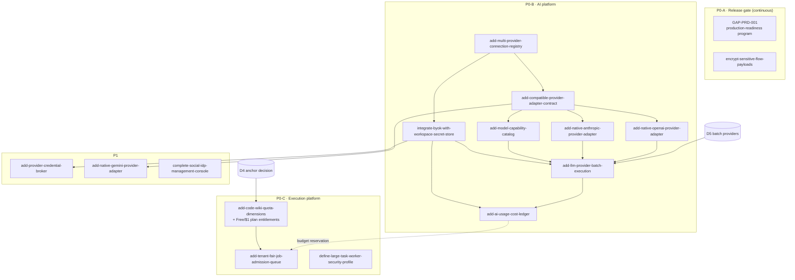

# Delivery Plan — LLM Code Wiki Platform + Falcone Gap Closure

v0.1 · 2026-08-04 · Companions: `llm-wiki-functional-requirements.md` v0.5 · `falcone-gap-analysis.md` v0.5 · baseline `LLM_CODE_WIKI_FUNCTIONAL_REQUIREMENTS.md` v1.0 · `FALCONE_GAP_ANALYSIS_FOR_LLM_CODE_WIKI.md` v1.0

## 0. Operating model

Two tracks with a hard boundary:

- **Track F — Falcone platform.** Agent: **Claude Opus 5** via Claude Code. Owns `gntik-ai/falcone` only. Closes the platform gaps through the OpenSpec process.
- **Track P — Portal (product).** Agent: **Codex with GPT-5.6 Sol**. Owns the product repos only. Builds the code-wiki domain services and frontend.

Rules that apply to both agents:

1. **Contracts are the interface — and no mocks (decided 2026-08-05).** Versioned OpenAPI + event schemas live in a shared `contracts` repo; Track P consumes them read-only. When a capability doesn't exist yet, the platform change lands first: the portal never simulates a platform API and never implements the gap app-side — dependent UI waits behind a feature flag for the real endpoint. This puts FAL-001/FAL-002 on the portal's critical path.
2. **Everything references IDs.** Every OpenSpec proposal, epic, story and PR cites FR-x (v0.5 scope layer), baseline IDs (AUTH/SRC/PRJ/MOD/RUN/ING/ANL/WIK/DIA/SYN/UX/QNA/COL/EXP/NOT/CST/ADM/DAT/ERR-nnn) and/or GAP-FAL-x.
3. **Tests first, small PRs.** Acceptance criteria come from the referenced requirement text; the agent writes the failing test before the implementation.
4. **Mandatory human review** on sensitive areas: credential handling, SSRF/egress, worker sandboxing, tenant isolation, public publication, payments, anything touching OpenBao/Keycloak/Temporal payloads.
5. **Release gate.** No external private repository is ingested before the §19 go/no-go checklist and the GAP-PRD-001 production-readiness program are complete.

## 1. Step 0 — Decisions that block specs (owner)

| # | Decision | Blocks |
|---|---|---|
| D1 | Free-plan limit values (1 concurrent run proposed; repo-size cap) | FAL-010 entitlements, M9 |
| D2 | Paid plan = $1 **per month** USD (vs one-time)? | FR-PLAN, M9 |
| D3 | Payment provider (Stripe proposed) | M9 |
| D4 | Billing/entitlement anchor: per user, per workspace or per organization (per workspace proposed) | FAL-008/010 spec, FR-RUN-07, M9 |
| D5 | Launch providers with validated **batch** (OpenAI + Anthropic proposed) | FAL-004/006 scope, M4 |
| D6 | Languages with structural parsing at launch (others → bounded text analysis, ANL-004) | analysis-worker scope, M1/M3 |
| D7 | Retention defaults/maxima (raw source, prompts/responses, wiki versions, chat) | DAT-007, M10 |
| D8 | Falcone workspace mapping (personal WS per user + one Falcone WS per org workspace?) — baseline §29.11 | Track F tenancy wiring, M1 |
| D9 | Public wikis: code snippets from public repos by default? — §29.10 | M7 |

Until a D-item is decided, the affected spec carries the proposal as an explicit assumption, flagged for confirmation — never silently.

## 2. Track F — Falcone (Claude Opus 5 / Claude Code)

### 2.1 Setup (once)

- `CLAUDE.md` in the falcone repo: OpenSpec conventions, required proposal sections (API/event contracts, authz, failure/idempotency semantics, migration, secret redaction, audit, quotas, black-box + multi-replica tests, runbook, readiness evidence), sensitive-area review list, "reference IDs" rule.
- falcone-testing skill + loop-kit wired as the maker/checker driver on the shared Kubernetes cluster (default kubectl context, Falcone namespace — kind is no longer used).

### 2.2 Phase F0 — Verify before building

Run the capability loop against the authoritative assessment's **Covered/Partial** claims and the §19 go/no-go list. Output: CONFIRMED evidence per claim, and the 15 OpenSpec changes opened with verified current-state sections (the assessment was static; this closes that caveat).

### 2.3 OpenSpec dependency graph

DeepSeek/Kimi ride the **tested** compatible adapter (FCON); they get native adapters only if a required capability demands it.

### 2.4 Waves

| Wave | Changes | Notes |
|---|---|---|
| W1 | F0 verification · FAL-001 · FAL-012 · FAL-010 spec (needs D4) · PRD-001 kickoff | FAL-012 and PRD-001 run continuously from here |
| W2 | FAL-002 · adapter contract (FCON) · FAL-008 | FAL-008 can start once FAL-010 spec is approved |
| W3 | native OpenAI + Anthropic adapters · FAL-005 | |
| W4 | FAL-006 (batch) · FAL-007 (ledger) | needs D5 |
| W5 (P1) | FAL-003 · FAL-011 · Gemini adapter | FAL-003 becomes P0 only if a launch provider requires OAuth/cloud identity |

### 2.5 Per-change workflow

1. Opus 5 drafts the OpenSpec proposal (all required sections) → owner review/approval.
2. **Contract first:** OpenAPI + event schemas land in `contracts` → client generated → Track P unblocked.
3. Implement with maker/checker (independent verifier agent); black-box + multi-replica tests on the cluster (Falcone namespace).
4. Runbook + docs → merge → capability inventory updated → blockers board updated.

## 3. Track P — Portal (Codex / GPT-5.6 Sol)

### 3.1 Repos & setup (once)

Services per target architecture §14: `wiki-api`, `repo-connector-service`, `analysis-orchestrator`, `analysis-worker`, `wiki-renderer`, `search-chat-service`, notification module, `frontend`. Each repo gets an `AGENTS.md` (conventions, ID rule, DoD with tests, sensitive-area review list) and CI with contract tests against the `contracts` repo. Local/integration environment: the real Falcone on the shared cluster (default context, its own namespace); no mocks — not-yet-landed capabilities stay feature-flagged until their real endpoint exists (blockers board §4).

### 3.2 Milestones — gates are the baseline acceptance journeys

| M | Gate | Scope (v0.5 / baseline) | Platform dependency |
|---|---|---|---|
| M1 First wiki (public repo, sync) | AC-001, AC-004 | FR-AUTH · FR-PROV (one connection) · FR-REPO public URL + content safety (ING-016…020) · FR-PROJ create/list · minimal sync pipeline · FR-WIKI viewer, citations, Mermaid | current single-provider LLM API (operator-configured); Keycloak config; D6, D8 |
| M2 Control | AC-005, AC-006 | cancel queued/running, retry, queue position UI, run states | FAL-008 for real position (flagged "queued" without rank until then) |
| M3 Incremental + versions | AC-007, AC-008 | FR-UPD full: diff/impact, full-scan fallback, atomic publication, rollback, owned sections | FAL-009 worker profile |
| M4 Batch | AC-009, AC-010 | FR-RUN-08/09 · CST-013…025 mixed execution, correlation, partial failure | FAL-005/006/007; D5 |
| M5 Private sources | AC-002, AC-003, AC-011 | GitHub App, GitLab app, SSH, revocation handling | FAL-002 live (no credential mocks); **PRD-001 gate before real private repos** |
| M6 Chat & search | AC-013 | FR-CHAT · hybrid lexical+vector · version scope | pgvector covered; FAL-001 for chat model connection |
| M7 Publication & sharing | AC-014 | FR-SHARE: unlisted/public links, public/source separation, hosted rendering (ex-GAP-09) | D9 |
| M8 Organizations & collaboration | ORG/COL journeys | FR-ORG: orgs, workspaces, invitations, project roles, comments/review/activity | platform tenancy covered; product RBAC |
| M9 Plans & billing | — | FR-PLAN: Free/$1, checkout, receipts, dunning; entitlement enforcement | FAL-010 + FAL-008; D1–D4 |
| M10 Hardening → private beta | AC-015 + §19 go/no-go | deletion/purge graph, audit coverage, notifications polish, DAT/ERR items | PRD-001 complete |

M1→M4 are sequential gates; M5–M9 can overlap once their dependencies land; M10 closes v1.

### 3.3 Story hygiene

One story = one or few baseline IDs + acceptance criteria copied from the requirement text + failing test first + small PR. Codex never touches `falcone` or the `contracts` repo; contract change requests go to Track F via the blockers board.

## 4. Blockers board (portal ⟵ platform)

| Portal feature | Blocked by | Interim |
|---|---|---|
| Settings ▸ Models (multi-provider, self-service keys) | FAL-001 + FAL-002 | operator-configured single provider via the current API; self-service screens flagged off |
| Queue position / jobs-ahead | FAL-008 | show "queued" without rank (flag) |
| Batch mode | FAL-005 + FAL-006 (+D5) | policy UI hidden behind flag |
| Cost views & budgets | FAL-007 | token counts only, no currency |
| Plan entitlements enforcement | FAL-010 (+D1/D4) | app-side soft check, clearly temporary-free zone: enforcement waits for platform |
| Social IdP admin UX | FAL-011 or product admin | operator-side Keycloak config |
| Private repositories in beta | PRD-001 + §19 | public repos only |

Weekly integration on the shared cluster; the falcone-testing loop runs as the regression suite over both tracks' merged state. Contract changes are versioned with a deprecation window (EXP-030).

## 5. This week

1. Owner answers D1–D9 (D4 and D5 first — they block W1/W4 specs).
2. Create `contracts` repo + CI client generation.
3. Track F: write `CLAUDE.md`, run F0 verification, open W1 OpenSpec proposals.
4. Track P: scaffold repos + `AGENTS.md`, draft M1 stories referencing IDs, point kubectl at the shared cluster.
5. Stand up the blockers board (§4) where both agents can read it.
